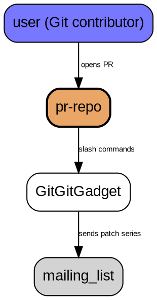
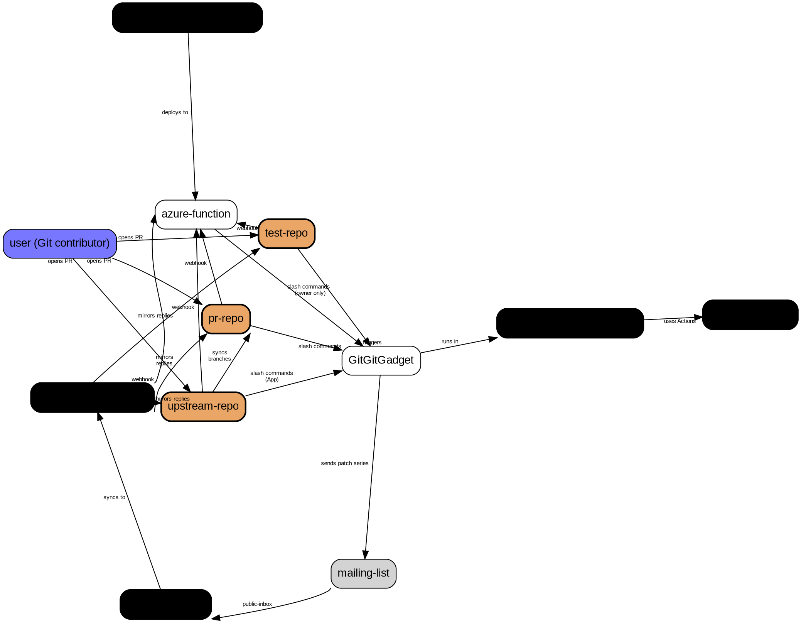

The essence of GitGitGadget can be illustrated by this diagram

Of course, when adding a couple of details, it gets quite a bit more complicated. For example, GitGitGadget needs write permissions on the `pr-repo`, to push the tagged patch series, and to store its state in Git notes. Most upstream projects do not like that, and therefore GitGitGadget works on a `pr-repo` which is a fork of an `upstream-repo`. However, a _read-only_ variant of GitGitGadget's GitHub App can be installed on the `upstream-repo`, in which case GitGitGadget _does_ handle PRs in the `upstream-repo` but the state and the tagged patch series still live in `pr-repo`.

For testing purposes, there can also be `test-repo`, another fork of `upstream-repo` (but only the owner of the `test-repo` is allowed to use GitGitGadget there).

GitGitGadget also needs access to the mailing list in the form of a [public-inbox](https://public-inbox.org/README.html) repository, to be able to mirror replies back to the PRs.

# How does GitGitGadget process user comments on PRs?

GitGitGadget is implemented as a GitHub App (with the very imaginative name ["GitGitGadget"](https://github.com/apps/gitgitgadget)), which means that a webhook is called on certain events, such as new PR comments on PRs (e.g. `issue_comment`).

In GitGitGadget's case, this webhook is implemented as [an Azure Function](https://github.com/gitgitgadget/gitgitgadget-github-app).

Apart from validating that the payload really originated from GitHub, the Azure Function performs a rudimentary check whether the comment (if it was triggered by a comment) contains a command that GitGitGadget should act on, and depending on that check triggers [the `handle-pr-comment` GitHub workflow](https://github.com/gitgitgadget-workflows/gitgitgadget-workflows/actions/workflows/handle-pr-comment.yml), which creates a Check Run that is shown in the Checks tab of the PR.

The `push` event (and also the `pull_request` event) is also handled by the Azure Function, triggering [the `handle-pr-push` GitHub workflow](https://github.com/gitgitgadget-workflows/gitgitgadget-workflows/actions/workflows/handle-pr-push.yml), which creates a Check Run that is shown in the Checks tab of the PR.

Either workflow calls one of GitGitGadget's GitHub Actions, which are very thin wrappers around [the `CIHelper` class](https://github.com/gitgitgadget/gitgitgadget/blob/HEAD/lib/ci-helper.ts) that implements the core logic.

# Mirroring replies from the Git mailing list to GitGitGadget's PRs

This is performed by [the `handle-new-mails` GitHub workflow](https://github.com/gitgitgadget-workflows/gitgitgadget-workflows/actions/workflows/handle-new-mails.yml). It calls [the `handle-new-mails` GitHub Action](https://github.com/gitgitgadget/gitgitgadget/tree/HEAD/handle-new-mails), which is a very thin wrapper around [the `CIHelper` class](https://github.com/gitgitgadget/gitgitgadget/blob/HEAD/lib/ci-helper.ts) that implements the core logic. The workflow runs are triggered by updates to the main branch of GitGitGadget's [mirror of the Git mailing list archive](https://github.com/gitgitgadget/git-mailing-list-mirror/), thanks to [GitGitGadget's GitHub App](https://github.com/gitgitgadget/gitgitgadget-github-app) reacting to the corresponding `push` event.

# Update PR labels and mentioning when/where the patches were integrated

The PRs labels are updated, and the comments that document how the corresponding branch is called and when the patches were integrated and into which branch(es), and the PRs are closed when the patches hit `master` and/or `maint` by [the `update-prs` GitHub workflow](https://github.com/gitgitgadget-workflows/gitgitgadget-workflows/actions/workflows/update-prs.yml). It calls [the `update-prs` GitHub Action](https://github.com/gitgitgadget/gitgitgadget/tree/HEAD/update-prs), which is a very thin wrapper around [the `CIHelper` class](https://github.com/gitgitgadget/gitgitgadget/blob/HEAD/lib/ci-helper.ts) that implements the core logic. It is triggered by updates to the `seen` branch at https://github.com/git/git, thanks to [GitGitGadget's GitHub App](https://github.com/gitgitgadget/gitgitgadget-github-app) reacting to the corresponding `push` event.

# Keeping https://github.com/gitgitgadget/git up to date

The repository gitgitgadget/git is kept up to date by three GitHub workflows:

- [`sync-ref`](https://github.com/gitgitgadget-workflows/gitgitgadget-workflows/actions/workflows/sync-ref.yml), which is triggered by branch updates in https://github.com/git/git (via [GitGitGadget's GitHub App](https://github.com/gitgitgadget/gitgitgadget-github-app), because GitHub Actions does not support cross-repository triggers), handling a single branch per workflow run.
- [`sync-gitster-git`](https://github.com/gitgitgadget-workflows/gitgitgadget-workflows/actions/workflows/sync-gitster-git.yml), which is a scheduled workflow, bulk-updating all `maint-*` and `<initials>/<topic>` branches in one go.
- [`sync-git-gui-branches`](https://github.com/gitgitgadget-workflows/gitgitgadget-workflows/actions/workflows/sync-git-gui.yml), which is a scheduled workflow, bulk-updating all of Git GUI's branches into the `git-gui/` ref namespace in one go.

## Why synchronize both git/git _and_ gitster/git?

### Background

The existence of the `git/git` -> `gitgitgadget/git` workflow is probably obvious.

The `gitster/git` repository contains the individual branches for code contributions, and the first reason why the corresponding workflow was added is that `seen` had test failures all the time without any actionable information: it has been always unclear _which_ of those patch series that made it into `seen` was responsible for the test failures. Now with the individual branches being mirrored into `gitgitgadget/git`, and obviously triggering [CI builds]https://github.com/gitgitgadget/git/actions/workflows/main.yml), it is a lot easier to find the culprits.

Of course, from time to time the `seen` failures are caused by unfortunate interactions of separate patch series' changes, in which case the CI builds of the individual branches may very well succeed but `seen` still causes failures, which is a very useful piece of information in and of itself.

A secondary benefit of mirroring the `gitster/git` branches is that PRs at `gitgitgadget/git` can target more fine-grained base commits. I use this a lot, e.g. in my six "built-in add -i/-p" patch series which build on top of each other.

While the workflow that synchronizes with `gitster/git` is a scheduled workflow that is runs once per day, the workflow that synchronizes with `git/git` is triggered immediately (via `push` events, thanks to a read-only version of GitGitGadget's GitHub App being installed on the latter repository).

### Git GUI's branches

As GitGitGadget can also be used to contribute Git GUI patches and patch series, there is [the `sync-git-gui` GitHub workflow](https://github.com/gitgitgadget-workflows/gitgitgadget-workflows/actions/workflows/sync-git-gui.yml). It mirrors the branches of Johannes Sixt's repository (i.e. the current Git GUI maintainer's authoritative repository) into the `git-gui/*` namespace on `gitgitgadget/git`.
